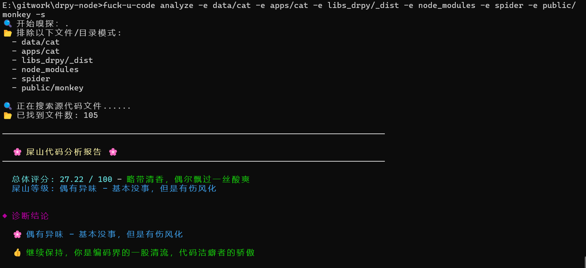
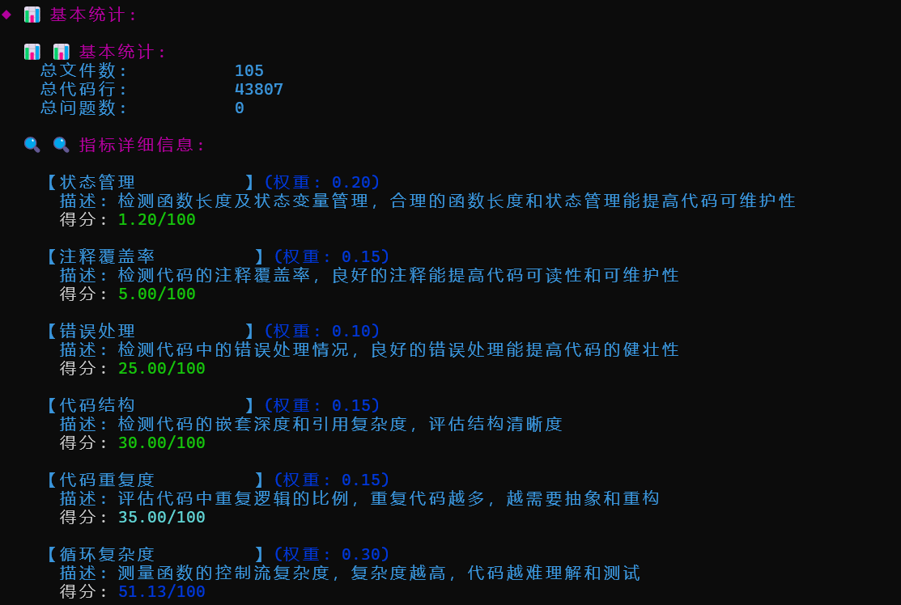

# 评估报告图片





# 评估报告文本

🔍 开始嗅探：.
📂 排除以下文件/目录模式:

- data/cat
- apps/cat
- libs_drpy/_dist
- node_modules
- spider
- public/monkey
  ────────────────────────────────────────────────────────────────────────────────

🌸 屎山代码分析报告 🌸
────────────────────────────────────────────────────────────────────────────────

总体评分: 27.22 / 100 - 略带清香，偶尔飘过一丝酸爽
屎山等级: 偶有异味 - 基本没事，但是有伤风化

◆ 诊断结论

🌸 偶有异味 - 基本没事，但是有伤风化

👍 继续保持，你是编码界的一股清流，代码洁癖者的骄傲

────────────────────────────────────────────────────────────────────────────────

